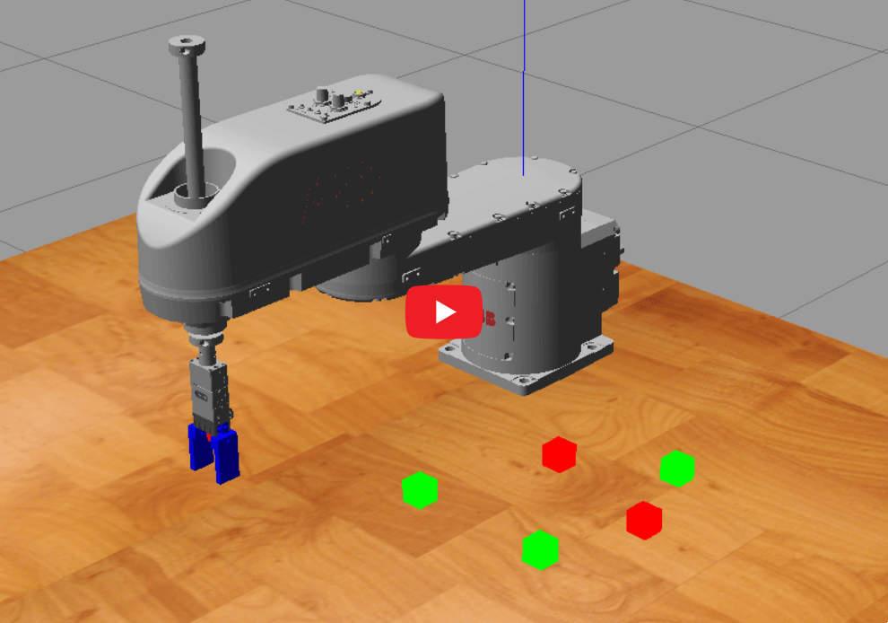
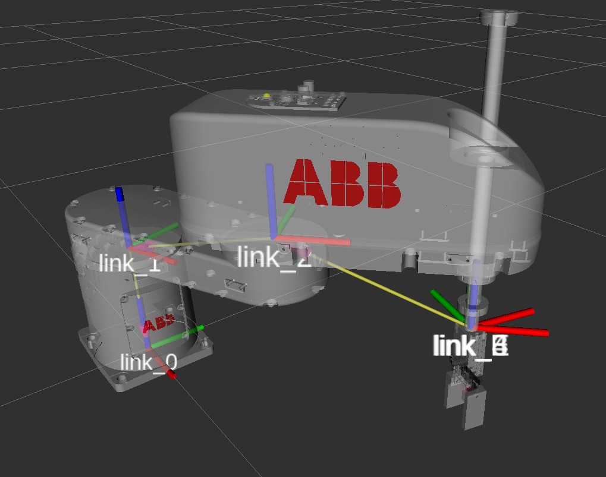
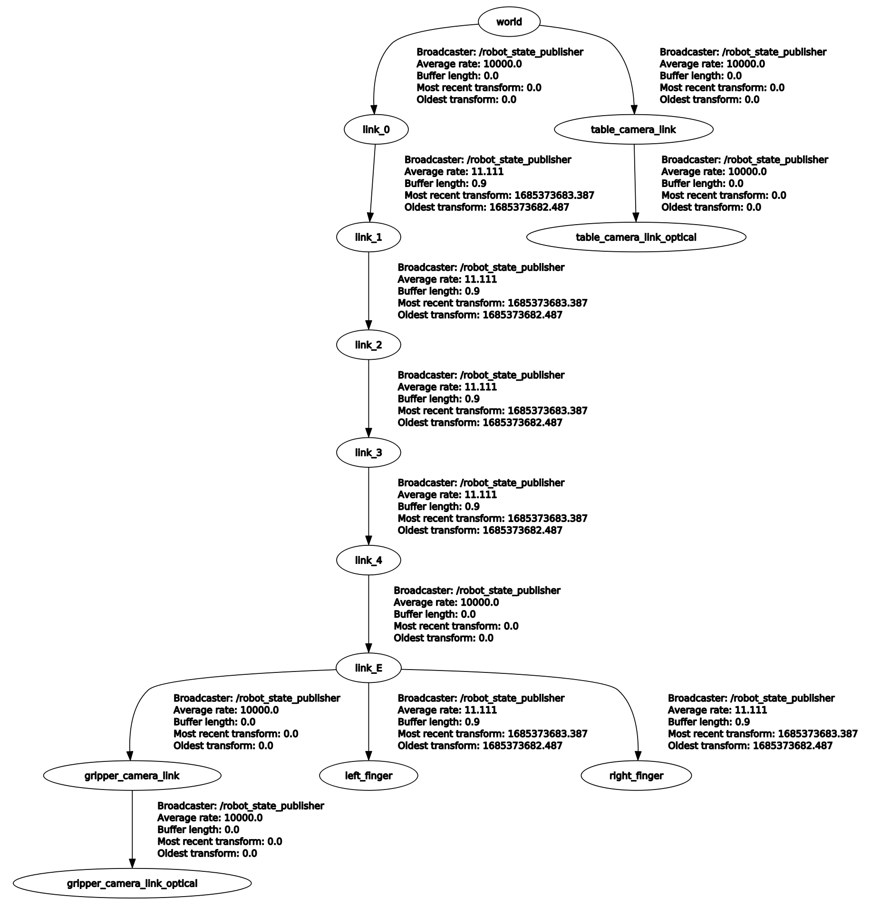
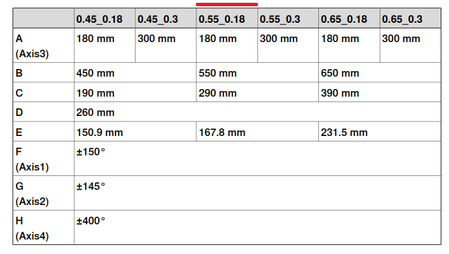
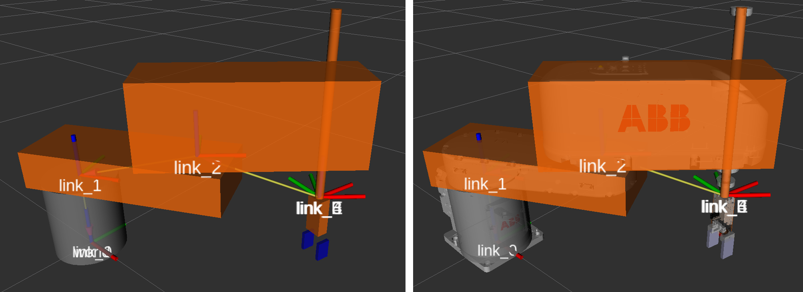
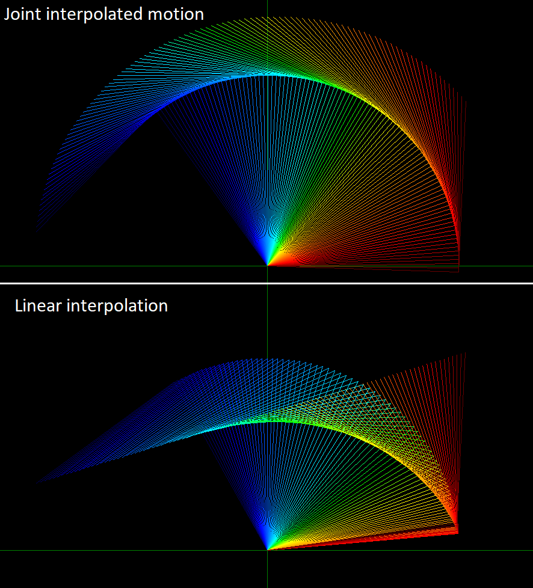
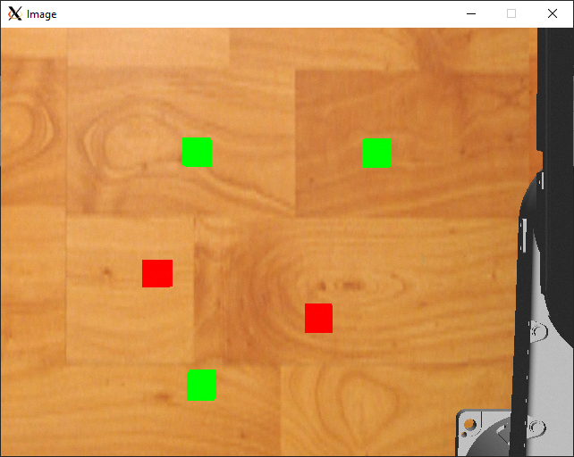
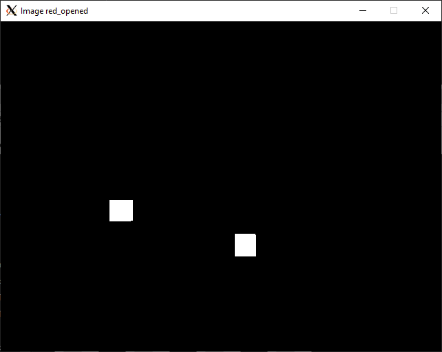
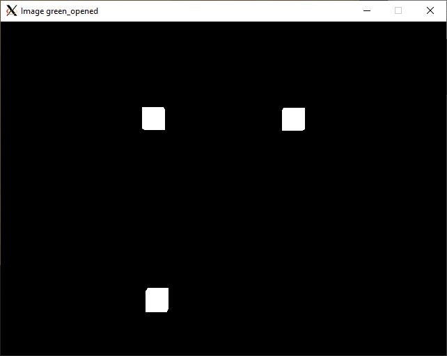
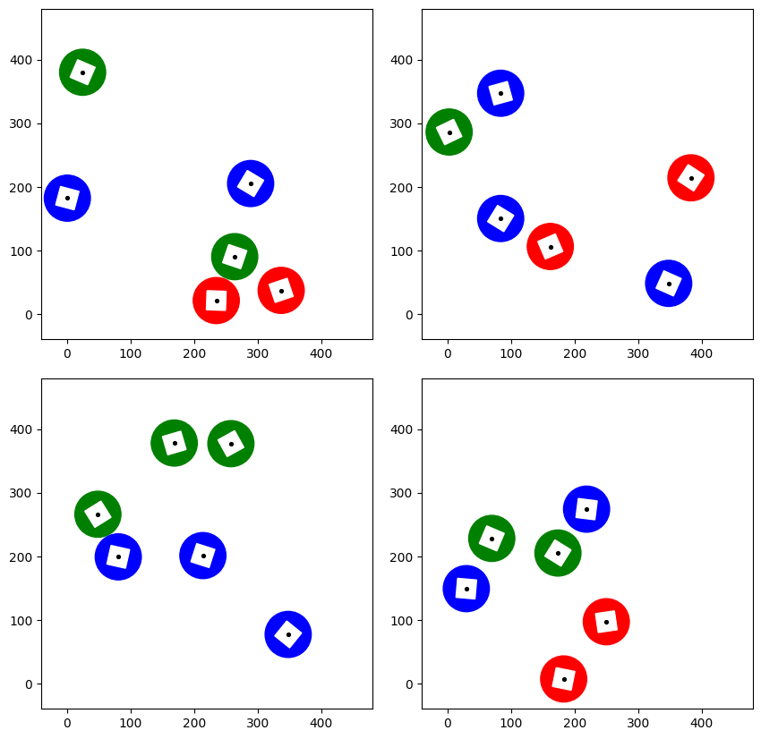

<p align="center">
<br>
</p>


# Robotrendszerek laboratórium projektfeladat


<font size="3">
      Készítették:<br />
      Kovács Tamás Barnabás<em>@kovszegtom</em><br />
      Petrőtei Tamás József <em>@petroteitamas</em><br />
</font>


# Tartalomjegyzék
1. [Feladat bemutatása](#1-feladat-bemutatása)  
2. [Program futtatása](#2-program-futtatása)
3. [Megvalósítás lépései](#3-megvalósítás-lépései)

      3.1. [Robot felépítése](#31-robot-felépítése)

      3.2. [Koordinátarendszer felépítése](#32-koordinátarendszer-felépítése)

      3.3. [Inverz kinematika megvalósítása](#33-inverz-kinematika-megvalósítása)

      3.4. [Képfeldolgozás megvalósítása](#34-képfeldolgozás-megvalósítása)

      3.5. [Robot mozgatás](#35-robot-mozgatás)
4. [Továbbfejlesztési lehetőségek](#4-továbbfejlesztési-lehetőségek)
5. [Összegzés](#5-összegzés)


# 1. Feladat bemutatása

A tárgy keretein belül egy olyan robotmanipulációt programot készítettünk el, amely képes egy virtuális kamera segítségével különböző színű kockákat szétválogatni. A program önállóan képes detektálni az elhelyezkedő kockák számát, és azon helyzeteit.


<a href="https://youtu.be/ZBNHiPTMlw4" target="_blank">
 
</a>


# 2. Program futtatása
 
A program indításának első lépése, hogy betöltsük a Gazebo fizikai szimulációs környezetet, majd elindítsuk abban a szimulácitó.

```console
roslaunch bme_ros_pp_project spawn_robot.launch
```
A program egyszerűbb futtatása érdekében létrehoztunk egy bash file-t, így a projekt indítása méggyorsabb tud lenni a következő paranccsal (tab nyomásával a részlegesen beírt parancs kiegészül):

```console
./start.bash
```

Ezt követően két külön modult kell még elindítanunk. Egyrész azt amely az inverz kinematikai számításokat végzi, másrészt azt amely a kameraképet feldolgozza, kiértékeli és kiküldi az előzőleg elindított modulnak.

Tehát indítsuk el a következő két modult
```console
# rosrun bme_ros_pp_project sub_xyzw_ikin_pub_joint.py
./ikin.bash
```

```console
# rosrun bme_ros_pp_project pub_cam.py
./pi.bash
```

A program segítségével a robot önállóan elvégzi a kockák szín szerinti szétválogatását.


# 3. Megvalósítás lépései

## 3.1. Robot felépítése

Az projekt megvalósítása során célunk az volt, hogy a vizuális szemléltetés érdekében egy létező fizikai robotot fogunk a ROS által biztosított szimulációs környezetben megjeleníteni. Mivel az ABB márkájú robotoknak ingyenesen, publikusan hozzáférhető mesh fájljuk van, valamint a dokumentációjuk is számunkra kellő mértékben részletes, továbbá a megvalósítandó feladat 2.5D manipulációval is végrehajtható, így esett a választás az [IRB 920-6/0.55](https://search.abb.com/library/Download.aspx?DocumentID=3HAC075723-001&LanguageCode=en&DocumentPartId=&Action=Launch) típusú SCARA kinematikájú robotra.


A letöltött STEP modellek koordinátarendszeri nem voltak számunkra megfelelőek, így Inventor segítségével a Denavit-Hartenberg paramétereknek megfelelő koordinátarendszerbe transzformáltuk azokat. Egy online STEP to DAE konverter segítségével átkonvertáltuk a 3D modelljeinket, azonban azzal szembesültünk, hogy Gazibo környezetben a grafika eltűnt. Kisebb utánajárást követően .obj formátumba kiexportált 3D állományokat már meg tudtunk nyitni Blenderben, ahonnan már probléma mentesen ki tudtuk exportálni .dae formátumba.


## 3.2. Koordinátarendszer felépítése

<p align="center">
<br>
A robot koordinátarendszere
</p>


A Khalil-Dombre féle módosított D-H paramétereknek megfelelően a Z tengelyek körül történik az egyes Jointok mozgatása. SCARA felépítésű robot esetében ez a tengely kizárólag függőleges irányú.


<p align="center">
<br>
A robot koordinátarendszere
</p>


A koordinátarendszerek felépítését követően definiáltuk az egyes csuklók mozgástartományát, mely adatok a robot adatlapjában megtalálhatók.

<p align="center">
<br>
Tengelyhatárok
</p>


Az egyes tagok befoglaló méretei alapján felparamétereztük a collision geometryt, majd ezen tagok méretei alapján számításokat végeztük az egyes tagok tömegei és tehetetlenséi nyomatéki mátrixainak tekintetében. A számítások a mellékletek (attachment) mappában található.

<p align="center">
<br>
Ütközési geometriák
</p>


## 3.3. Inverz kinematika megvalósítása

A robot descartes koordinátarendszerbeli mozgatásához meg kell oldanunk az inverz kinematikai feladatot. A SCARA felépítésű robot pick and place feladatok megvalósításánál leredukálható 2 DoF-ra, tehát síkban történő mozgatásra, valamint 


Az inverz kinematikai helyes megvalósításáról egy Python kódot is készítettünk, amelyben szemléltetjük mind a csuklótér mind a munkatérbeli lineáris interpolációt.


<p align="center">
<br>
Csukló és lineáris interpolált mozgás
</p>


A programkód megtalálható az illustration_codes mappán belül


## 3.4. Képfeldolgozás megvalósítása

Képfeldolgozás segítségével lehetőség van a fizikai könyezetbe elhelyezett kockák helyzeteinek kinyerésére. 


<p align="center">
<br>
A kamera által látott kép
</p>


<p align="center">
<br>
Piros színre szűrt kép
</p>


<p align="center">
<br>
Zöld színre szűrt kép
</p>


A képfeldolgozás lépései:
 * A kép fogadása (ROS Subscriber)
 * A kép konvertálása (CvBridge)
 * HSV színtérbe konvertálás
 * Színszűrő alkalmazása
 * Zaj eltávolítása nyitás morfológiai művelettel
 * A kép címkézése (objektumok szegmentálása)
 * A kép felcímképett objektumainak helyzeteinek kinyerése.
 * A kamera és a robot koordinátarendszere közötti transzformáció elvégzése.
 * A megtalált objektumhelyzetek listába rendezése, majd kulcs-érték párral ellátott változóba helyezése

 Az így megállapított pozíciók a robot felvételi (pick pozíciói).


 ## 3.5. Robot mozgatás

A robot a képfeldolgozás során megállapított pontokból egymáshoz képest X irányban, inkrementálisan növelt, előre meghatározott helyzetekbe szállítja a kockákat. A jelen feladatban a két különböző színű kockát két külön sorba helyezi el.

Egy mozgásciklus a következő lépésekből áll:
* Felvételi pont fölé mozgás (a koordináták az image processtől érkeznek)
* Felvételi pozícióba mozgás
* Robotmegfogó zárása
* Felvételi pont fölé mozgás
* Lerakási pont fölé mozgás (a koordináták Y értéke szín szerint változik és egy csoporton belül X irányban inkrementálódik)
* Lerakási pozícióba mozgás
* Robotmegfogó nyitása
* Felvételi pont fölé mozgás


# 4. Továbbfejlesztési lehetőségek
 1. Orientáció detektálása
 2. Dinamikus kockagenerálás

      Erre egy programot is készítettünk melynek eredményét a következő kép szemlélteti, azonban idő hiányában nem sikerült a programba implementálni.
    
      <p align="center">
      <br>
      Az algoritmus által kigenerált random színű és helyzetű kockák <br> (Négy futtatás eredménye)
      </p>

      A generáláshoz használt programkód megtalálható az illustration_codes mappán belül

 3. Több, előre nem definiált szín szerinti szeparáció


# 5. Összegzés
A feladat megoldásánál sok, korábbi tárgyból megszerzett ismeretet tudtunk hasznosítani, az elméleti tudásunkat gyakorlati alkalmazásba átültetni.

